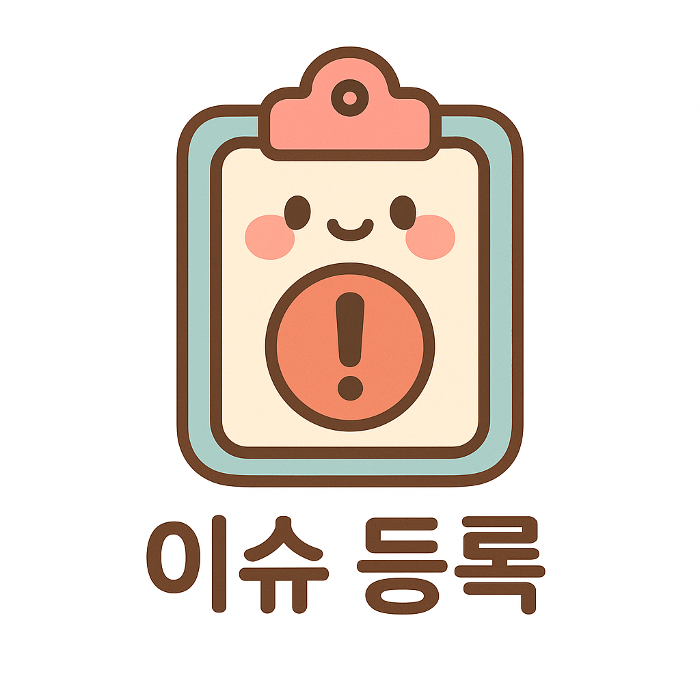

# 💻 AlgoDuo


<!-- open된 pr 확인하는 버튼 -->
<a href="https://github.com/soyeon1806/AlgoDuo/pulls" style="display: inline-flex; align-items: center; text-decoration: none;">
    
    <span style="color: black; font-size: 1.2em;">오픈된 PR 수: <strong><!--PR_COUNT--></strong></span>
</a>


<!-- 풀고 싶은 문제 등록하는 버튼 -->
<a href="https://github.com/soyeon1806/AlgoDuo/issues/new?title=[플랫폼]%20문제이름%20/%20레벨&body=⭐%20제목%20:%20[플랫폼]%20문제_이름%20/%20레벨%0A%20%20%20%20%20%20☑%20[BOJ]%20:%20백준%0A%20%20%20%20%20%20☑%20[PGS]%20:%20프로그래머스%0A%20%20%20%20%20%20☑%20[ETC]%20:%20그%20외%20사이트%0A%0A⭐%20라벨%20:%20알고리즘 분류%0A%20%20%20%20(없는%20라벨은%20새로%20등록하기)%0A%0A⭐%20문제%20링크%3A" style="display: inline-flex; align-items: center; text-decoration: none;">
    
    <span style="color: black; font-size: 1.2em;">문제 등록하기</span>
</a>


<!-- 이번주 문제 확인하는 버튼 -->
<a href="https://github.com/soyeon1806/AlgoDuo/issues" 
   style="display: inline-flex; align-items: center; text-decoration: none;">
    
    <span style="color: black; font-size: 1.2em;">이번주 문제 확인하기</span>
</a>

<br/><br/>

## ⭐ 스터디 멤버

<table>
 <tr>
    <td align="center"><a href="https://github.com/soyeon1806"></a></td>
    <td align="center"><a href="https://github.com/Hyykk"></a></td>
  </tr>
  <tr>
    <td align="center"><a href="https://github.com/soyeon1806"><b>soyeon</b></a></td>
    <td align="center"><a href="https://github.com/Hyykk"><b>yoonkyo</b></a></td>
  </tr>
  <tr>
    <td align="center">
      
    </td>
    <td align="center">
      
    </td>
  </tr>
</table>

<br/><br/>

## ⭐ 스터디 기본 정보

<table>
  <tr>
    <td>진행 기간</td>
    <td>2024년 11월 12일 ~ </td>
  </tr>
  <tr>
    <td>스터디 방식</td>
    <td>온라인</td>
  </tr>
  <tr>
    <td>정기 스터디 시간</td>
    <td>화요일 16:00 ~ 18:00</td>
  </tr>
  <tr>
    <td>플랫폼</td>
    <td>프로그래머스</td>
  </tr>
  <tr>
    <td>언어</td>
    <td>
    
    </td>
  </tr>
</table>

<br/><br/>

## ⭐ 참여 방법

1. 이 저장소를 `clone` 한다.
2. 본인의 이름으로 브랜치를 생성한다.
3. 본인의 이름으로 폴더를 생성한다.
4. 플랫폼 별로 폴더를 생성한다.
5. 알고리즘 풀이 후 본인의 브랜치에 `push`한다.
6. `main` 브랜치에 `PR`을 보내 코드 리뷰를 요청한다.
7. 스터디원에게 리뷰를 받은 후, 수정이 완료되면 `merge` 한다.


<br/><br/>

## ⭐ Commit Message Convention

```
{타입}: {플랫폼 태그_문제 제목} | {커밋 메시지}
```

```
[예시]
feat: PGS_주식가격
feat: BOJ_구슬_탈출_2
feat: ETC_Two_Sum (LeetCode)
refactor: DFS -> BFS
style: 함수명 변경
```

<br/>

### 📌 타입

| 타입 | 설명 |
|:--  |:--  |
| chore | 기타 작업들 |
| comment | 주석 추가 및 오타 수정 |
| docs | README와 같은 문서 수정 |
| feat | 소스코드 파일 추가 |
| move | 파일 및 폴더 이동 |
| refactor | 코드 리팩토링 |
| rename | 파일 및 폴더명 수정 |
| style | 코드 포맷팅, 세미콜론 누락 수정 |

<br/>

### 📌 플랫폼
| 플랫폼 | 태그 |
|:--  |:--  |
| 프로그래머스 | PGS |
| 백준 | BOJ |
| 그 외 | ETC |

<br/><br/>

## ⭐ PR 규칙

```
[날짜] {플랫폼} {문제 제목} - {이름}
```

```
[예시]
[241105] PGS 주식가격 - 소연
[241105] BOJ 구슬 탈출 2 - 윤교
```

<br/><br/>

## ⭐ Directory 구조
```
└── 📂soyeon
       ├── 📂PGS
       │      ├── 💾문제이름.java
       │      ├── 💾...
       │      └── 💾문제이름.java
       ├── 📂BOJ
       └── 📂ETC
└── 📂yoonkyo
       ├── 📂PGS
       │      ├── 💾문제이름.py
       │      ├── 💾...
       │      └── 💾문제이름.py
       ├── 📂BOJ
       └── 📂ETC
```